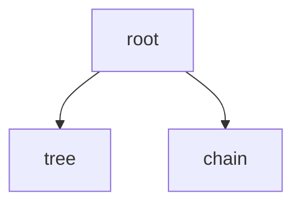
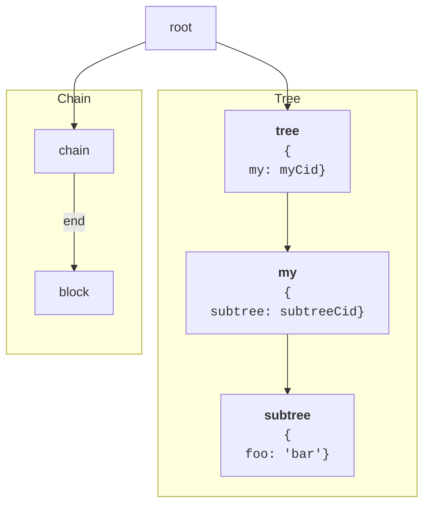

# What's a ChainTree?

## Overview

A ChainTree is a new data structure that represents both digital and physical objects in Tupelo.

A ChainTree is a combination of a tree representing the current state, and a blockchain representing the previous states of an object. The blockchain part of a ChainTree is a linked list of blocks containing transactions. The tree is the current state of the ChainTree created by running the previous transactions. ChainTrees let you store arbitrary data in the leaf nodes of the tree using the  [IPLD standard](https://ipld.io/) .


```mermaid
graph TD
Root --> Tree
Root --> Chain
subgraph Tree
  Tree --> Arb["Arbitrary Tree"]
  Arb --> Anything
  Arb --> uw["user wants"]
  Tree --> _tupelo
  _tupelo --> Tokens
  _tupelo --> Ownership
  Ownership --> PublicKeys
end
subgraph Chain
Chain -- Latest --> b3["Block 3"]
Chain -- Genesis --> gen
b2["Block 2"] --> b3
gen["Genesis"] --> b2
end
```

A ChainTree is [content addressable](https://en.wikipedia.org/wiki/Content-addressable_storage), meaning that a single hash of the root uniquely represents the entire data structure.

[Tupelo's whitepaper](https://docs.quorumcontrol.com/docs/whitepaper.html) explains how ChainTrees use [IPLD](https://ipld.io/) internally.

> [...] at a high level, IPLD specifies how to link data structures using a content addressable system (hashing). Conceptually similar to JSON, Tupelo uses CBOR (Compact Binary Object Representation) to model the data inside a ChainTree. CBOR specifies a canonical way to create a binary given key/value pairs. An object can link to another object by specifying a CID as a value within one if its key/value pairs. A CID represents a hash of the object linked TO. In this way, a single tip (hash of the root object) can be used to verify that all children of the object have not been tampered with.

ChainTrees are the super power behind Tupelo. Tupelo only needs to reach consensus on a simple hash instead of the full, complex structure. Furthermore, Tupelo only needs to store a hash of each object because it requires clients to supply the relevant history and state needed to validate  transactions. Tupelo nodes use the root hash validate both state transitions and that the history hasn't been altered.

Modifying a ChainTree involves playing transactions against the current state to get to a new state. Those transactions happen in blocks and become part of the chain section of the ChainTree.

For instance, given the following ChainTree:


I could run a "set data" transaction on the ChainTree:

```json
{
	"type": "SET_DATA",
	"payload": {
	  "path": "/my/subtree/foo",
	  "value": "bar"
    }
}
```

That would result in the following chain tree:




And block would look like this:
```json
{
  "headers": {
    "signatures": {
      "owner": "asignature",
    },  
  },  
  "block": {
    "height": 0,
    "previousTip": null,
    "transactions": [{
      "type": "SET_DATA",
      "payload": {
        "path": "/my/subtree/foo",
	"value": "bar"
      }   
    }]
  }
}
```

Using the set data transactions, you can set data to any part of the tree and the data structure preserves the history of those changes.
