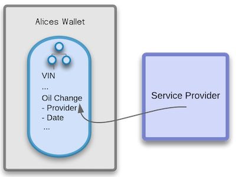

# Tupelo Overview
{: .fs-9 }
{: .no_toc .text-delta }

## Table of contents
{: .no_toc .text-delta }

1. TOC
{:toc}

## What is Tupelo?

Tupelo is a new Distributed Ledger Technology (DLT) project that is fundamentally different. Rather than a single blockchain, Tupelo maintains a separate history for every object. The history is kept in a new data structure called a Chain Tree. This foundational change is ideal for a variety of applications that concern assets (both physical and digital) and supports crypto currency applications.

## Understanding Tupelo
Most DLT systems are built around a detailed accounting of who has how many fungible (interchangeable) coins. Foundationally, Tupelo is built to model more complex, unique, real-world or digital things. Every object in Tupelo innately has one or more owners, a variety of attributes, and a unique history.

For example, consider a car, a house, a digital collectible, a person’s identity, or a batch of coffee moving through a supply chain. Each of these objects has many unique instantiations with different features. Their attributes may change over time but they all represent a singular unique entity, have specified owners at any given time, and have a history that persists.

## Modeling Cars in Tupelo
To further illustrate the key concepts behind Tupelo we will consider how a car might be modeled in more detail.

Alice is buying a new car from Volkswagen (VW). VW generates a new Chain Tree on Tupelo (described in more detail later) to represent this new car. The Chain Tree includes basic information to identify the car like the VIN# as well as relevant information about which features it has (i.e. color, interior, etc.) Because of the flexibility of Chain Trees, a wide range of different types of data can be included such as a scan of relevant paperwork or the path it took during transport. In fact, if VW was using Tupelo for their supply chain, this starting point could have included even earlier history such as the manufacturer and sustainability of sub-components.

At the time of sale, VW transfers this Chain Tree and all its relevant data to Alice. All of the details and history come under her control within her “wallet” through which she manages her assets. VW can no longer make changes to that information without Alice’s permission. It is her car and she owns the digital as well as the physical representation of it. Even though Alice is the owner that does not mean she can alter the earlier history of the car. The VIN# has been set at its creation by VW. All of the information set during its creation and all modifications since are irrevocably recorded as part of the Chain Tree. It has been “signed” via the Tupelo network and will always be a part of its history. Alice can provide this information to anyone she wishes as proof and still retain control of it. Tupelo’s underlying structure provides a flexible base for limited read or write capabilities which can be critical to many applications.

As Alice drives her car and gets it serviced, she has the service provider attest to the services performed and that is appended to the vehicles history. This could be as simple as scanning and attaching the paperwork from the oil change, or as sophisticated as the service provider digitally signing and submitting a change to Alice's Chain Tree for inclusion in the vehicle's history.

When Alice eventually decides to sell her VW she has the accumulated history of the car from its manufacture through its service, to help assure a buyer of its original paint color and that it has been well maintained. When Alice transfers the car to Bob, Bob then takes the associated Chain Tree into his wallet. The history and provenance of the vehicle becomes his to take forward. This digital representation can enhance the value of the car by providing unalterable evidence of its origin and history.

Other DLT systems can, and are, being used to model these types of digital and physical entities. Tupelo however has several major advantages over other DLT and blockchain solutions. This is because Tupelo has been purpose built to manage these types of objects from the ground up. With Tupelo it is more efficient to store and process information about objects and more flexible in managing them.

## Tupelo Essential Structures

Tupelo models asset ownership with a new data structure called a Chain Tree. Every asset and actor (every thing) in the system has their own Chain Tree. A Chain Tree is the combination of an individual ordered log of transactions and the current state of an object. All of the powerful DLT features such as decentralization and immutability are maintained but in a lighter-weight way. In addition, the structure provides an easy way for arbitrary data to be included in the Chain Tree. Each node in the tree can be thought of as a directory or folder in which data can be stored. The flexibility of Chain Trees opens up a range of powerful applications. The permissions for each “folder” in the Chain Tree can also be managed independently to control who can see or edit the information beyond its owner. This type of functionality requires side-chains or complex parallel storage mechanisms with other DLT solutions.

By using Tupelo, application developers have the flexibility to efficiently model their domain and then can use the Tupelo consensus network for fast, verifiable confirmation of their data.

## Difference From Existing Protocols

Consensus algorithms are how computers and users agree on the truth in any distributed ledger technology or blockchain solution. Bitcoin uses Proof of Work and a huge network of competing miners burning energy to solve an essentially arbitrary problem. That “work” is used to agree on the true state of the information in the system. Ethereum also uses Proof of Work but is in the process of transitioning to Proof of Stake. With Proof of Stake, signers (the nodes verifying transactions) must put at risk a quantity of tokens as a guarantee that they will only verify valid transactions. For Bitcoin, Ethereum, or any of the other existing DLT/Blockchain project the consensus being reached is on a single universal “chain” of approved transactions without any one party being in charge.

Tupelo is a Proof of Stake based system. This means Signers work together (as part of a Notary Group) to come to consensus on submitted requests and risk losing their stake if they sign bad transactions or do not meet performance requirements. Tupelo Signer’s stake is made in Tuples which are the utility token used to operate the network. Tuples are also used by clients making transaction requests. As with other Proof of Stake systems the signers (like miners in Proof of Work) are rewarded for performing this service for the wider network.

Tupelo has an advantage over other public DLT/blockchain solutions because it works on individual Chain Trees rather than one central global chain. Signers in the Tupelo system are performing a much simpler task. Tupelo achieves consensus in a fraction of the time and with many fewer exceptions. This is possible because what Tupelo is accomplishing is so much more targeted. Tupelo only needs to consider transactions in the context of a specific entity and its most recent history instead of every transaction for every entity or object ever recorded. Because of that smaller target, it can achieve the same value at a lower cost. The unique structure also means that the type of data maintained about each entity or object is much more flexible. It can be larger and more complex because all signers do not need to store the full history of all of that data. This keeps resource costs lower than with other solutions.

With Tupelo, a group of signers is called a Notary Group. The Notary Group keeps track of the current state of every Chain Tree in order to prevent forking (differing histories). The Notary Group does not need to keep the entire history, nor the entire state of every Chain Tree, but only the latest state. That state is captured as the “tip” of that Chain Tree which is a hash of the newest information about the thing represented by the Chain Tree. Request the full Tupelo Whitepaper for more details on how Notary Groups, Chain Tree history, and how Tupelo consensus guarantees data integrity and security.

## Tupelo Consensus Protocol

A client who wants to make a change to a Chain Tree they own starts by submitting a request to any valid signer in the current Epoch. Each Epoch is approximately one hour and is used to manage the active signer list. It is important to note that the TCP (Tupelo Consensus Protocol) does not require the synchronization of clocks across signers or clients. The protocol is largely asynchronous to maintain simplicity as well as resilience. Request the Tupelo Whitepaper for more details on how this works.

When a client requests a change to their Chain Tree they include the previous valid tip (a cryptographic hash that encapsulates the current state and history of the Chain Tree), the new altered state, and the resulting new tip including those changes. Essentially this is a before and after of the update they are proposing to their Chain Tree.

The signer in the notary group that receives the request then uses the Tupelo signer p2p network to coordinate with the other signers. They rapidly reach a ⅔ majority agreement (consensus) on the validity of the transaction. Once the network reaches a 2/3rds majority on the validity of the transaction, the client receives confirmation that their transaction/update has been confirmed and the new tip is the valid state of that Chain Tree. Any subsequent changes to that Chain Tree need to built on the new signed tip.

Unlike Proof of Work consensus algorithms, this does not require significant energy for the signers which keeps the process fast and energy efficient. The Notary Group quickly comes to agreement as all of the information needed to sign is immediately available and streamlined. Signers have all of what they need and nothing outside this transaction complicates the process of confirmation.

The Tupelo protocol is designed to reward fast and accurate signers. This motivates signers to respond to client requests quickly and helps keep the network performant.
If a Chain Tree owner sends two conflicting transactions, the Notary Group uses what’s called a fork choice rule to pick the best transaction. Request the Tupelo Whitepaper for more details on how this process works.

## Developer Use of Tupelo

One of the core strengths of Tupelo is the simplicity of the interface (API) provided for developers. Client apps do not need to keep any history but their own. (With some blockchain/DLT solutions you must maintain the full history of the entire system to interact with the network). Interacting through a straight forward API rather than a complex new construct like a smart contract lets developers quickly build using the layer of trust provided by Tupelo as well as the skills and tools they already have.

For illustration purposes the current API includes the following high level requests:
  * SET_DATA
  * SET_OWNERSHIP
  * ESTABLISH_COIN
  * MINT_COIN
  * SEND_COIN
  * RECEIVE_COIN

Tupelo is not focused on building a purely financial system but rather a utilitarian one. That however does not mean that it cannot mint or transfer coins. Other DLT systems have central universal storage and Chain Trees are distributed, but that does not mean Tupelo is in any way inferior at preventing double spends. Double spends occur when a single user trades their tokens away more than once, which is the core challenge of managing coins.

A Chain Tree owner can never double spend because the SEND_COIN transaction will not be approved unless there is enough of a balance. The owner cannot fork their Chain Tree to add fraudulent spends, and a receiver cannot add more RECEIVE_COIN blocks without having valid (and unique) transaction ids signed by the Notary Group. Request the Tupelo Whitepaper for more details on how Tupelo maintains coin integrity.

Tupelo allows for unlimited currencies without smart contracts. It is important to note that these capabilities are particularly valuable for applications that involve fractional ownership or other shared ownership models.

Tupelo is built in Go and currently has a native API for Javascript with more native libraries on the way. Rather than being forced into using a newly created smart contract language, developers can work in the languages they know and extend the benefits of decentralization to their apps without reinventing the many tools that have made those languages and frameworks successful.

## Industry Opportunities
Tupelo’s unique features make it good for modeling things, be they physical or virtual assets or devices collecting data.

### Real world assets

Real world assets such as real estate or cars are an excellent fit for Tupelo. Application developers can easily model these assets with the flexible data structure that automatically tracks their history. One or more people own the structures themselves, and those people can grant non-owners limited read or write capability. These features are all fundamentally derived from the Chain Tree itself directly modeling their existence not as a coin, but as a singular owned data structure.

### Digital assets

Digital assets are modeled similarly to real world assets. The underlying data structure represents the digital asset in question be it a collectible or in-game item. The speed of the system is particularly valuable for transactions involving digital assets. Digital transactions often need to happen in real time. Users’ patience for transactions that take tens of seconds or worse is very low and will undermine adoption. Low transaction costs also help Tupelo’s fit as a solution for digital assets as these are often high volume, low value transactions.

### Internet of Things

Internet of Things leverages three key features of Tupelo. First, the requirements on devices submitting requests through the API are very lightweight. Contributing data to a Chain Tree has extremely low processing requirements in contrast to the alternatives. Devices can operate with minimal processing power and remain cheap. Secondly, Tupelo’s entity specific Chain Trees enable IoT devices the ability to work “offline”. Transactions are accumulated if the connection is unavailable and submitted as a batch within a single request when the connection is re-established. More powerfully, devices can remain entirely offline and users of those devices can simply supply signed ChainTrees to interact with them locally when needed. Finally, because of the highly efficient nature of the Tupelo network, transaction costs will be very low when compared to the alternatives.

### Supply chains

Supply chains are a natural fit on Tupelo because they are made up of a combination of the above categories. Digital representations of supply chains are a combination of physical assets that need to be modeled and the IoT devices that monitor and report on them. It is also important to note that because Tupelo is the trust layer of DLTs abstracted into a service, existing Supply Chain systems could be enhanced to include trust within existing systems rather than requiring a wholesale rewrite.

### Information security

Information security is the original problem that spurred all of the innovations behind Tupelo. Rapid transaction times for logins or access requests are critical to adoption. Inexpensive transaction costs are required because security applications will have high volume leading to prohibitive costs. Finally, Tupelo’s support for a range of private, semi-private and public information associated with assets, even as part of the same Chain Tree, supports several key usage and auditing scenarios.

## Conclusion

To reiterate, Tupelo maintains the speed of private DLT solutions which can support high transaction volumes and speed requirements, but it accomplishes this not through compromising the key DLT premise of decentralized control but through a fundamentally different, streamlined structure.

---
### Interested in building on Tupelo, have comments or want to learn more?  
Please get in touch and a human will review your question or request and get
back to you shortly.  We are building Tupelo for **use** and know that to
succeed we will need to support the community building on the platform.  Give
us a chance to put those values into action.  Please contact us!

<form action="https://getsimpleform.com/messages?form_api_token=e5c297254e437ec5b14c8207d9a15e08" method="post">
  <!-- the redirect_to is optional, the form will redirect to the referrer on submission -->
  <!-- <input type='hidden' name='redirect_to' value='http://quorumcontrol.com' />
  <!-- all your input fields here.... -->
  <h4 id="example" style="padding: .5em 4em .5em;">Name
  <!-- input type='text' name='Name' size="50" required style='color:blue;'/> -->
  <input type="text" name="fname" size="30" style='color:blue;' class="field-divided" /> <input type="text" name="lname" size="30" class="field-divided" style='color:blue;'/>
  <h4 id="example" style="padding: .5em 4em;">Email
  <input type='email' name='Email' size="62" required style='color:blue;'/>
  <h4 id="example" style="padding: .5em 4em;" >Organization
  <input type='text' name='Organization' size="52" style='color:blue;'/>
  <h4 id="example" style="padding: .5em 4em;">Request or Comment    
  <textarea name="comment" cols="69" rows="5" style='color:blue;'></textarea>    
  <input type='submit' value='Submit Request or Question' class="btn btn-green fs-5 mb-4 mb-md-0 mr-2" />
