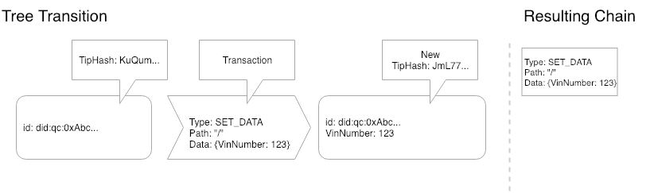
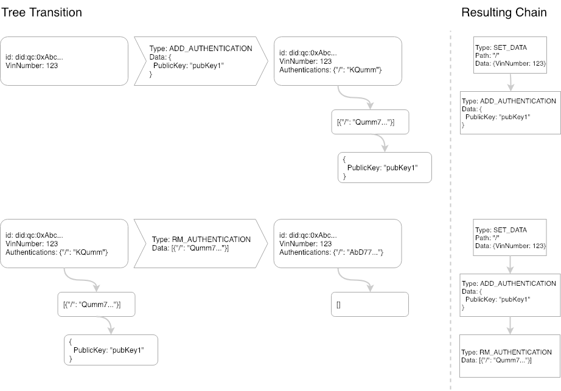
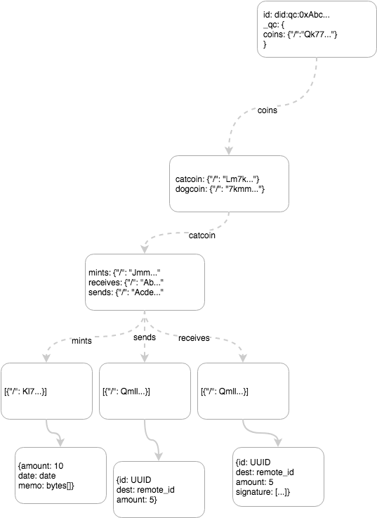
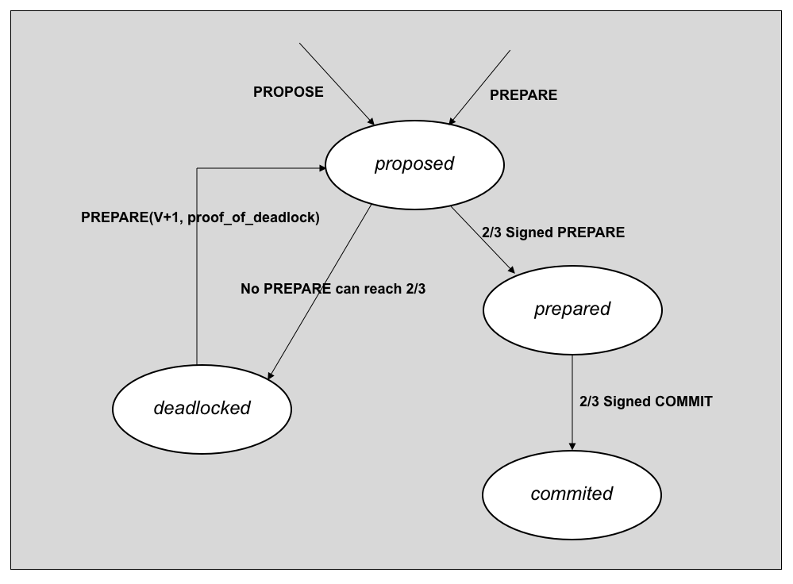

# Tupelo Whitepaper
{: .fs-9 }
{: .no_toc .text-delta }

## A better way forward for digital asset ownership:
{: .no_toc .text-delta }
## Chain Trees & Notary Groups: Tupelo Working Draft - October 2018 - v0.10
{: .no_toc .text-delta }

## Abstract

Digital asset ownership systems can achieve faster processing time, more decentralization, and less overhead by adopting a client-lead consensus algorithm and removing global transaction ordering. Introducing an individual append-only log (blockchain) combined with a notarized merkle-DAG (directed acyclic graph) per actor allows for a variety of protocols to be built on top of a byzantine fault tolerant global layer of trust while scaling to hundreds of thousands of transactions per second. We call this combination of blockchain and merkle-DAG a Chain Tree. The combination of a Chain Tree and a public Notary Group is a system we are calling Tupelo.

## Table of contents
{: .no_toc .text-delta }

1. TOC
{:toc}

## Background

The current state of the art in cryptocurrency systems is referred to as “distributed ledger technology (DLT).” Most DLT systems model asset ownership/transfer as quantities sent between accounts within atomic transactions. If Alice wants to send Bob 5 tokens, she creates a transaction on the ledger which debits her account 5 tokens and increases Bob’s account 5 tokens. In order to prevent Alice from double spending, Bob has to wait until the ledger has come to a consensus that Alice’s transaction is valid. The distributed ledger needs to keep a global ordered transaction log to make sure that Alice has the 5 tokens to spend. Global ordering is one of the reasons many distributed ledgers can only process tens of transactions per second globally.

Additionally, these systems are not suited for real-world asset ownership. Distributed ledgers were designed to model currency and similar concepts such as stocks and bonds, but there are few systems where transferring ownership of items like real estate or cars (or door locks, routers, etc) is ideal. Developers have used existing systems as timestamp generators, but the systems themselves aren’t designed for individual objects.

Tupelo builds upon the work of others including:
  * [Cosi/Cothority](https://github.com/dedis/cothority/tree/master/cosi)
  * [BLS Multisignature](https://crypto.stanford.edu/~dabo/abstracts/aggreg.html)
  * [W3C DID spec](https://w3c-ccg.github.io/did-spec/)
  * [Secure Scuttlebutt](https://github.com/ssbc/)
  * [Nano](https://nano.org/en)
  * [Holochain](https://holochain.org/)
  * [Gosig](https://www.semanticscholar.org/paper/Gosig%3A-Scalable-Byzantine-Consensus-on-Adversarial-Li-Wang/e62df2883a75f11ca9d288450ece4f61e077a3e4)
  * [Casper FFG](https://arxiv.org/abs/1710.09437)
  * [IPLD](https://ipld.io/)

## Overview
We model asset ownership with a new data structure called a Chain Tree.  Every asset and actor in the system has their own Chain Tree. A Chain Tree is the combination of a merklized DAG and an individual ordered log of transactions. This structure can be thought of as a single-branch git for data.

A group of Signers (as part of a Notary Group) keeps track of the current state of every Chain Tree in order to prevent forking. The Notary Group does not need to keep the entire history nor the entire state of every Chain Tree, but only the latest tip (a hash of the current root node).

We are able to do away with all Signer-to-Signer communication for transaction signing using a new client-driven consensus protocol.

Putting these concepts together allows for a high level of parallelization and a dramatic decrease in message volume, while maintaining the same, high, level of security as traditional DLT.

## Chain Tree ##

A Chain Tree is similar in concept to Git, but with known (and, later, user-definable) transactions on data instead of simple text manipulation. A Chain Tree is a state-machine where the input and resulting state is a content-addressable merkle-DAG. Playing ordered transactions on an existing state produces a new state. We use the IPLD format to model Chain Trees.

This whitepaper won’t go into the details of IPLD, but, at a high level, IPLD specifies how to link data structures using a content addressable system (hashing). Conceptually similar to JSON, Tupelo uses CBOR (Compact Binary Object Representation) to model the data inside a ChainTree. CBOR specifies a canonical way to create a binary given key/value pairs. An object can link to another object by specifying a CID as a value within one if its key/value pairs. A CID represents a hash of the object linked TO. In this way, a single tip (hash of the root object) can be used to verify that all children of the object have not been tampered with.

To illustrate this data structure, we will take a look at a couple of transactions, starting very simply, then moving to slightly more complex.



##### Figure 1 - A simple transition ####
--

In Figure 1, We can see that there was an empty tree, we played the `SET_DATA` transaction on the tree and ended up with a new tip for the tree and a new entry in our chain. This is the simplest possible scenario, where the “tree” is actually just a single node and we are just setting data on the root node. The result is a data structure of the combination of a 1 node chain and a 1 node tree.



##### Figure 2 - Two new transaction types ####
--

In Figure 2, there are two separate transactions taking place on the Chain Tree created in Figure 1. The State Machine acting on this Chain Tree knows how to handle an `ADD_AUTHENTICATION` and it does so by adding a link to the Authentications on the root node to a list of authentications and appending this entry to that list (in this case: an empty set). Next, we play a `RM_AUTHENTICATION` transaction on the Chain Tree which removes the node created by the `ADD_AUTHENTICATION`. Playing the chain on the right will always result in the same tree created on the left. The tip of the Chain Tree is created by hashing the root node. This allows for a content-addressable tree of unlimited size to be signed by a single hash value.

## Actors

Every actor in the system (both identities and assets) may have one or many Chain Tree(s). Actors create a new, global, Chain Tree by creating a new public/private secp256k1 key-pair. The Chain Tree’s ID is a DID derived from the ethereum-style address of the public key (created the same way that Ethereum creates addresses based on public keys). An example Chain Tree DID is: `did:tupelo:0xDD4f79D433FC132dc22e662F25B5D46fADFfa16`. Before any transactions have been played on the Chain Tree, the Chain Tree is in the genesis state. The owner of a genesis Chain Tree is the holder of the private key that corresponds to the address in the Chain Id.

Ownership of a Chain Tree may be changed by adding public keys to a system-defined path in the tree. In the case of this system the path /\_tupelo/authorizations should contain a set of links to public keys. If /\_tupelo/authorizations is defined on the Chain Tree then this ownership overrides the keypair used to create the Chain Tree.

Only the owner(s) of a Chain Tree may create new transactions on a Chain Tree. The tip of a Chain Tree refers to the hash of the root node of the current state of a Chain Tree (a Chain Tree with all transactions applied).

Transactions are arbitrary mutations of state. The client and Notary Group must agree on the process of mutating state through named transactions. The initial release will include the following transactions\:
  * SET_DATA
  * SET_OWNERSHIP
  * ESTABLISH_COIN
  * MINT_COIN
  * SEND_COIN
  * RECEIVE_COIN

Later, we will discuss how user-defined transactions can be used to expand the system in a manner similar to smart-contracts on other DLT systems.

## Payments Through Cryptocurrency

Initial implementations include a protocol to transfer quantities of a token. Conceptually this is the same as any other cryptocurrency token such as Ethereum or Bitcoin. Chain Trees and Notary Groups accomplish double-spend protection on top of the existing layer of trust described above and do not need a global ledger. This system allows for unlimited currencies on the same notarized system without the need for smart contracts.

Currency exchange introduces 4 transaction types: `ESTABLISH_COIN`, `MINT_COIN`, `SEND_COIN`, `RECEIVE_COIN`. The Chain Tree structure is modeled as in Figure 3. This layout allows for efficient double-spend checking by sending in all the receives. However, a future improvement to the protocol will use balance check pointing and a cryptographic accumulator (or zk-snark) to prove non-existence of the receive.


##### Figure 3 - Cryptocurrency branch of a Chain Tree
--

```
ESTABLISH_COIN
message EstablishCoinTransaction {
    string name = 1;
    map<string>MonetaryPolicy maximum = 2;
}
```
Any actor may create one or more of their own coin types. A coin must be established before any coins can be minted, sent or received by any party. Monetary policy is optional but is intended for qualifiers such as hard caps on the number of coins to be issued.  These can not be altered once a coin has been established.  Additional monetary policy options and limiters will be added as the protocol matures.

```
MINT_COIN
message MintCoinTransaction {
    string name = 1;
    uint64 amount = 2;
    bytes memo = 3;
}
```

Any actor may mint their own coins once they have been established within that chaintree via an `ESTABLISH_COIN` transaction. They do so by creating a MINT transaction on their Chain Tree. In order for a `MINT_COIN` transaction to be valid, the name of the currency must be prefaced by their Chain Tree’s DID. An example cryptocurrency might be named: `did:tupelo:0xF964A90A0be7aC039E415aed6b2DD97651316700:cat_coin` where `did:tupelo:0xF964A90A0be7aC039E415aed6b2DD97651316700` is the DID and \'cat_coin\' is the name of the currency. The only potential limitation a Chain Tree owner has on minting more of their own currency is the Monetary Policy set in place when the coin was established.

```
SEND_COIN
message SendCoinTransaction {
   string id = 1;
   string destination = 2;
   uint64 amount = 3;
   string name = 4;
}
```

A `SEND_COIN` transaction is valid if in the state of the Chain Tree there is enough of a balance of “name” coin. The balance is calculated by adding all mints and receives in the Chain Tree and subtracting the Sends. The Chain Tree owner sends the signed tip (and the path through the Chain Tree) that includes the sendcoin. The “balance” is immediately deducted from their Chain Tree in the sense that they cannot add another `SEND_COIN` transaction for more than their balance which includes this transaction. The destination should be the DID of the receiving ChainTree. A `SEND_COIN` transaction is similar to a cashiers check in that the amount is deducted from the senders ChainTree at the time of the `SEND_COIN` transaction. This allows a `RECEIVE_COIN` transaction (see next section) to not depend on any future state of the sender’s ChainTree. The senders’ and receivers’ chain trees are updated independently and therefore there is no multiple Chain Tree transaction needed at the signer level.

```
RECEIVE_COIN
message ReceiveCoinTransaction {
   string send_coin_transaction_id = 1;
   bytes tip = 2;
   signature signature = 3;
   map<string>ChainTreeNode leaves = 4;
}
```

A `RECEIVE_COIN` transaction is valid if the Tip including the `SEND_COIN` transaction has been signed by the Notary Group and that Tip includes the transaction, it has a destination that matches this Chain Tree, and it has a `send_coin_transaction_id` that does not appear in the Chain Tree previously (preventing “double receive”).

### Cryptocurrency Discussion

A Chain Tree owner can never double spend because the `SEND_COIN` transaction will not be approved unless there is enough of a balance. The owner cannot fork their Chain Tree to add fraudulent spends. A receiver cannot add more `RECEIVE_COIN` blocks without having valid (and unique) transaction ids (which are signed by ⅔ of the Notary Group).

`SEND_COIN` can be included in every block as payment to the Signer if an incentification system is necessary for the Notary Group.

## Notary Groups (consensus algorithm)
A Notary Group is a registered, bonded set of validator nodes, called Signers, that collectively notarize the tip of every Chain Tree. When an actor adds a block of transactions to their Chain Tree, it sends the block and the new tip hash it creates to the Notary Group along with any state necessary to validate all the transactions in the block. Signers validate these blocks and, if valid, append their digital signatures and forward them to other Signers for more signatures. Once a block receives a supermajority of signatures, the new state, specifically the Merkleized tip of the actor’s Chain Tree, is effectively notarized and will be used as the canonical latest tip for validating the next block on that Chain Tree.

It is the responsibility of the Notary Group to prevent Chain Tree forks by notarizing at most one block proposal extending a given tip. When the Notary Group receives two or more valid blocks extending the same latest canonical tip, the blocks are said to be in conflict and together form a conflict set. All valid blocks extending the same tip are part of the same conflict set. A conflict set is resolved by choosing one block to be the canonical block and thus determining the new canonical tip. Upon resolution any owner whose proposed block (fork) wasn’t notarized can submit a new proposal for the block to extend the new canonical tip, which will place it into a different conflict set where it will likely be notarized.

Conflict set resolution is accomplished using a deterministic and instantly final consensus protocol that defines a fork choice rule for choosing the best block in any given conflict set. This consensus protocol is described in detail below.

### Tupelo Consensus Algorithm

The Tupelo Consensus Algorithm (TCA) is a leaderless Byzantine Fault Tolerant (BFT) consensus algorithm for resolving conflict sets. Chain Tree owners act as leaders proposing all new blocks on Chain Trees they own. TCA is based on an optimized version of the proposer-independent [Casper FFG protocol](https://github.com/ethereum/research/blob/master/papers/casper-basics/casper_basics.pdf) that uses [BLS signature aggregation](https://crypto.stanford.edu/~dabo/abstracts/aggreg.html) to realize $$O(NlogN)$$ message complexity and achieve greater scalability. To prevent Sybil attacks and incentivize Signers to follow the protocol, Signers are required to deposit bonds, which they can lose for attributable misbehavior. TCA’s Proof of Stake (PoS) incentive structures and validator set management are inspired by Casper’s, whereas the signature aggregation mechanisms and gossip protocol used in TCA are heavily influenced by [Gosig](https://arxiv.org/abs/1802.01315).

### Tuples: The Notary Group’s currency

The main coin of the system is called a Tuple. Tuples are used for rewards, staking and general payments on the Tupelo system. Tuples are minted from the Notary Group itself and are required for creating transactions and participating in the Proof of Stake system.

### Overview

Conflict set resolution is achieved by a two-phased, `PREPARE`, and `COMMIT` process in which Signers converge on the canonical block by voting (with their signature) using a simple fork choice rule. For the purposes of establishing quorum, signer votes are weighted by the size of their deposits. For simplicity the description of the protocol below presumes all Signers deposits are equal.

Figure 4 below shows the states, messages and transitions for the consensus protocol



#### Figure 4. State transitions of Tupelo Consensus Protocol
--

A block B extending Chain Tree tip T in view V, during cycle C is considered:
  * *proposed* by Signer $$i$$ if Signer $$i$$ has at least one `PROPOSE(B,T,C)` or `PREPARE(B,T,C,V,S)` but no `PREPARE`s where the weight of $$S\ >\ ⅔$$ Signer deposits
  * *prepared* by Signer $$i$$ if Signer $$i$$ has a `PREPARE(B,T,C,V,S)` where the weight of $$S\ >\ ⅔$$ Signer deposits
  * *committed* by Signer $$i$$ if Signer $$i$$ has a `COMMIT(B,T,C,V,S)` where the weight of $$S\ >\ ⅔$$ Signer deposits
  * *deadlocked* by Signer $$i$$ if Signer $$i$$ has a set of messages demonstrating that no proposed block can achieve $$> ⅔$$ Signer deposits in view $$V$$

In the common case there are no conflicting proposals and consensus is reached quickly. However, if the protocol becomes *deadlocked* each Signer will move to view to $$V+1$$ and apply the fork choice rule to select the best block $$B$$ to gossip. All Signers apply the same fork choice rule, which gravitates execution toward the happy path on the right.

The protocol operates efficiently by employing a Gosig-like gossip protocol in which a Signer, upon receiving a protocol message, performs some validations and signature aggregation, updates its state, and (in most cases) gossips a message to a randomly selected subset of other active Signers in the Notary Group during cycle $$C$$.

An epoch is the period during which the set of active Signers remains constant (see Signer Rotation below). A cycle is the period of time (about 1 minute) in which all Signer signature weights remain constant (see Incentives below). Any given cycle $$C$$ implies the epoch $$E$$ (e.g. if there are 60 cycles in an epoch, $$E\= C\ //\ 60)$$, and thus defines the set and signing weights of all active Signers for $$C$$.

### Conflict Set Resolution
The consensus process begins when a Chain Tree owner proposes a block by sending a signed `PROPOSE(B,T,C)` message to one or more active Signers for the given cycle $$C$$ (see Signer Rotation below). The `PROPOSE` message components are:

- $$B$$ - the block of transactions, new tip, any state required for validation
- $$T$$ - the previous tip being extended expressed as a (Chain Tree id, state hash) pair
- $$C$$ - the current cycle, which determines both the set of active signers and their stake weights

Upon receiving a `PROPOSE(B,T,C)` message the Signer validates the block by applying the transactions and checking that the resulting state matches the proposed new tip. The block will only be valid if the previous tip $$T$$ is equal to the canonical (last notarized) tip of the Chain Tree the current cycle as determined by the Signer’s clock is in in the range $$C*-1 \ldots C+4$$. The owner’s signature over `(B,T,C)` is also validated against the public key stored in the chain tree.

If the block is valid the Signer places it into a conflict set for $$T$$, transitions to the proposed state, and gossips a `PREPARE(B′,T,C,V,S)` message, where the components of the `PREPARE` message are:
- $$B′$$ - the block the Signer is voting for in view $$V$$
- $$T$$ - previous tip as $$T$$ specified in the PROPOSE message
- $$C$$ - the target cycle, always equal to $$C$$ specified in the `PROPOSE` message
- $$V$$ - the current view in which the Signer is voting for $$B′$$, initially set to $$0$$
- $$S$$ - the aggregated signatures of Signers voting for $$B′$$ in view $$V$$

If this is the first (and thus only) block proposal the Signer has seen for $$T$$ then $$B′$$ is set to $$B$$ and Signer appends its signature over `(B′,T,C,V)` to $$S$$ and gossips the `PREPARE`. Otherwise, the Signer just gossips the `PREPARE(B′,T,C,V,S)` it previously signed.

Signers should discard all `PROPOSE(B,T,C)` and `PREPARE(B,T,C,V,S)` messages where $$C <$$ the current cycle as determined by the Signer’s $$clock\ -\ 4$$. This accounts for clock drift and allows `PREPARES` at least one full epoch to accumulate signatures.

When a Signer adds its signature over `(B′,T,C,V)` to $$S$$ it is effectively casting a vote for $$B′$$ as the canonical block extending previous tip $$T$$ in view $$V$$. The vote is weighted by the size of the Signer’s deposit. The weight of $$S$$ is the sum of the weights of the aggregated signatures.

A Signer receiving a `PREPARE(B,T,C,V,S)` message will perform the actions described for `PROPOSE` above and also aggregate into $$S$$ any signatures from other `PREPARE` messages for the same block $$B$$. The Signer then checks if the aggregated weight of $$S$$ is greater than ⅔ the sum of all deposits of active Signers in cycle $$C$$. If so, the Signer transitions to the prepared phase, and creates, signs, and gossips a `COMMIT(P,S)` message, where the components are:
  - $$P$$ - the `PREPARE(B,T,C,V,S)` message where the weight of $$S > ⅔$$ Signer deposits
  - $$S$$ - the aggregated signatures of Signers commiting to $$B$$ in view $$V$$

For any PREPARE $$P$$ with signature weight > ⅔ Signer deposits, the Signer must always vote for it and gossip a `COMMIT(P,S)` message, even if the Signer previously sent a `PREPARE` voting for a different block or the block proposed in $$P$$ is not the Signer’s fork choice.

A Signer receiving a `COMMIT(P,S)` message will validate $$P$$ and aggregate signatures as described above. If the aggregated weight of $$S\ >\ ⅔$$ Signer deposits, the Signer transitions to the committed state in which the block $$B$$ specified in $$P$$ becomes canonical for $$T$$. The Signer can immediately discard the entire conflict set for $$T$$ (unless it participates in rewards as described below) and begin validating based on the new canonical tip specified in $$B$$.

### Deadlock Detection and Fork Choice Rule

The consensus process can deadlock when the remaining unsigned stake weight is not enough to get any block proposal past the ⅔ threshold. A signer that detects this condition becomes deadlocked with respect to `(T,V)`.

Formally, deadlock is detected by signer $$i$$ if, for some Chain Tree Tip $$T$$, candidate blocks $$B_{0}..B_{n}$$ extending $$T$$, corresponding signature stake weights seen in the latest `PREPARE(B_{i},T,C,V,S)` messages $$w_0..w_n$$, and total stake weight of all signers $$W$$, the following condition holds for all $$B_i$$


$$
w_i + (W - \sum_{j=0}^n w_j) \le ⅔W
$$


If a Signer detects a deadlock condition in view $$V$$ it applies the fork choice rule to select the best block $$B$$ and gossips a new `PREPARE(B,T,C,V+1,S)` message. This `PREPARE` message also includes the minimal set of `PREPARE` messages that prove deadlock in $$V$$ and justify the view change. If a Signer is currently in the prepared or proposed states for view $$V$$ (or lower) and receives such a `PREPARE` message then it can use the view justification to transition to the deadlocked state for view $$V$$ and start ignoring any messages for $$T$$ with $$V\ <\ V+1$$.  The Signer then applies the fork choice rule to select the best block for view $$V\ +\ 1$$ and if it matches the one in the received `PREPARE` just appends its signature and gossips the `PREPARE`. Otherwise it creates, signs, and gossips a new `PREPARE` message with the chosen block.

The fork choice rule is:
> *Given the set of all known proposals for extending tip T (i.e. all `PREPARE(B,T,C,V,S)` messages received), choose the one where hash(B) has the lowest value.*

The fork choice rule is only applied for views $$>\ 0$$, i.e. when the view changes due to a deadlock condition. For $$view\= 0$$, the Signer always votes for the first block proposal it sees, which, in the common case, does not have any conflicting proposals and is committed without any view changes.

### Protocol Violations
This section defines some protocol rules that can have economic penalties when violated. Since all messages are digitally signed with the sender’s private key, the signed message is proof that the Signer who sent it violated the rule.

#### Equivocation
The protocol forbids sending the following conflicting messages:
  * `PREPARE(B,T,C,V,S)` and `PREPARE(B′,T,C,V,S)` where $$B ≠ B′$$
  * `COMMIT(P,S)` and `COMMIT(P′,S)` where $$P ≠ P′$$

However, signers may send the following messages, which are not considered conflicting:
  * `PREPARE(B,T,C,V,S)` and `PREPARE(B′,T,C,V′,S)` where $$B ≠ B′$$ if $$V ≠ V′$$
  * `P=PREPARE(B,T,C,V,S)` and `COMMIT(P′,S)` where $$P ≠ P′$$
The first case allows signers to change the block they vote for in different views based on the fork choice rule applied to the latest set of messages they possess. The second case allows an honest signer who sent $$P = $$ `PREPARE(B,T,C,V,S)`, but then saw $$P′= $$ `PREPARE(B′,T,C,V,S)` with weight of $$S > ⅔$$ stake, to send `COMMIT(P′,S)` as dictated by the protocol.

#### Unjustified View Change
The protocol forbids sending a `PREPARE(B,T,C,V+1,S)` message without a view change justification or with a justification that does not sufficiently prove deadlock in view $$V$$.

#### Unjustified Commit
The protocol forbids sending a `COMMIT(P,S)` message where $$P$$’s signature weight is not $$> ⅔$$ Signer deposits.

#### Invalid New Tip
The protocol forbids sending `PREPARE(B,T,C,V,S)` or `COMMIT(P,S)` where the block $$B$$ being proposed contains invalid transactions, or the transactions are valid but the resulting state does not match $$T$$.

#### Reward Fraud
The protocol forbids transactions updating a Signer’s balance on the Notary Group Chain Tree (see Incentives below) without justification (e.g. `COMMIT` message) or with justification that does not match the balance update. Failure to report rewards is also a protocol violation.

### Incentives
Financial incentives are essential to secure the network. To incentivize Signers to participate, rewards are paid to Signers that actively participate in consensus. To prevent Sybil attacks and incentivize Signers to follow the protocol Signers are required to deposit bonds, which allow them to be penalized for violating protocol rules.

A node wishing to register as a Signer and become eligible to receive rewards for participating in consensus must first deposit its bond by appending to its Chain Tree a `DEPOSIT_STAKE` transaction, including the amount it wishes to stake, the public key to be used for authenticating protocol messages it signs, and the network address that other Signers and Chain Tree owners should use to send protocol messages to it.

```
DEPOSIT_STAKE
message DepositStakeTransaction {
   uint64 amount = 1;
   bytes key = 2;
   bytes address = 3;
}
```

This special transaction functions like a `SEND_COIN` with a fixed destination of the Notary Group Chain Tree. Once the `DEPOSIT_STAKE` transaction has been notarized an active Signer appends a corresponding `ACTIVATE_SIGNER` transaction on the Notary Group Chain Tree.

```
ACTIVATE_SIGNER
message ActivateSignerTransaction {
   uint64 amount = 1;
   bytes key = 2;
   bytes address = 3;
   string deposit_stake_transaction_id = 4;
   bytes tip = 5;
   signature signature = 6;
   map<string>ChainTreeNode leaves = 7;
}
```

The `ACTIVATE_SIGNER` transaction creates a balance for the public key of the Chain Tree that issued the `DEPOSIT_STAKE` and queues the candidate Signer to join the active Signer set in a future epoch (see Signer Rotation below). When that epoch arrives the candidate Signer will become active and start signing messages that support the consensus process. The messages it signs and doesn’t sign while a registered and active Signer will be used to determine whether it should be rewarded for contributing to the success of the protocol or penalized for hindering it.

When a node wishes to no longer participate in consensus it can issue a `RESIGN_STAKE` transaction on its own Chain Tree.

```
RESIGN_STAKE
message ResignStakeTransaction {
   bytes key = 1;
   bytes address = 2;
}
```

This transaction signals the Signer’s intent to leave and triggers an active Signer to append a `DEACTIVATE_SIGNER` message to the Notary Group Chain Tree.

```
DEACTIVATE_SIGNER
message DeactivateSignerTransaction {
   bytes key = 1;
   bytes address = 2;
}
```

#### Cycles

A cycle defines the period of time (about 1 minute) in which all Signer signature weights remain constant. This is necessary for all Signers to transition among protocol states in a consistent fashion and to agree on justifications such as proof of deadlock.

Every Signer’s signature weight is based on their current balance (their initial deposit plus rewards minus penalties) at the beginning of the cycle. Rewards for signed messages about blocks proposed in cycle $$C$$ are calculated and assessed in cycle $$C+6$$.

Cycle boundaries are determined by local clocks, which are not synchronized. Thus every conflict set to be resolved needs to be associated with a single cycle. This is done by specifying a cycle in the `PROPOSE` message. The cycle for a conflict set is the lowest cycle among all conflicting proposals, taking into account that all Signers in cycle $$C$$ will discard any messages corresponding to proposals specifying cycle $$< C-4$$.

The cycle associated with a conflict set is used as a timeout on conflict set resolution process. Specifically, if a block extending some tip $$T$$ is proposed in cycle $$C$$ has not been locally committed by the end of cycle $$C+4$$, then the Signer discards the associated conflict set and ignores any subsequent messages regarding $$T$$ except for a `COMMIT` signed by ⅔ Signers, which informs the Signer that the Chain Tree has an updated tip. Signers who are assigned to the Rewards Committees for $$T$$ (described below) retain their conflict sets until the end of $$C+6$$.  The timeout ensures that after 4 cycles consensus will either be reached or abandoned, allowing 2 full cycles for the Rewards Committees for $$T$$ to reach a steady state from which they can calculate and assess rewards and penalties.

#### Reward and Penalty Calculation and Assessment

Three types of calculations are performed: 1) Reward calculations are based on who participated in consensus 2) Penalty calculations are based on who failed to perform their reporting duties, and 3) Slashing calculations are based on more complex message sets that prove a Signer committed one of the protocol violations described above. Each calculation is described in detail below:

##### 1. Reward Calculations

For every notarized tip extension that was proposed in cycle $$C-6$$, the active Signers who signature was aggregated into the `COMMIT` for that tip have their balance on the Notary Group Chain Tree increased by `REWARD_RATE>` percent.

##### 2. Penalty Calculations
For every cycle $$C$$, the active Signers in $$C-1$$ who did not post a Rewards Report (see Rewards Report below) shall have their balance decreased by `<FAILURE_TO_REPORT_RATE>`. For each Active Signer $$S$$ who posted a Rewards Report for $$C$$ that omits signatures for conflict sets for which the Signer was a member of the Rewards Committee, the Signer shall have their balance decreased by `<SIGNATURE_OMISSION_RATE>` for each omission.

##### 3. Slashing Calculations
For every conflict set of some tip $$T$$ that was proposed in cycle $$C-6$$, all messages or message pairs demonstrating that some Signer committed Equivocation, Unjustified View Change, Unjustified Commit, Invalid New Tip, or Reward Fraud protocol violation, will result in the Signer’s balance being reduced to $$0$$, effectively removing their voting stake and ability to participate in future consensus processes.

#### Rewards Committee
Calculating and assessing rewards and penalties is done in a distributed fashion by randomly assigning a subset of active Signers, a Rewards Committee, to each conflict set resolution process.

For each conflict set of proposals extending some tip $$T_{old}$$ to a new tip $$T$$, a random subset of all Signers for the epoch, $$R_T$$, is selected to be responsible for reporting rewards on $$T$$. Anyone can compute $$R_T$$ as a function of $$T$$. For example, given an array of $$N$$ signers for the epoch, the signer at index $$T \bmod N$$ is primary, $$T+1 \bmod N$$ secondary and so on. Formally,

$$
R_T[i]\= Signers[(T+i) \bmod N]
$$

Once the conflict set for $$T$$ has been resolved, all signers not in $$R_T$$ can immediately delete all conflict set data regarding $$T$$ and ignore any further messages referencing $$T$$. Signers who are members of $$R_T$$ must retain their conflict sets for $$T$$ until the end of cycle in which rewards and penalties on $$T$$ are assessed (4 cycles).

Once each member of $$R_T$$ has aggregated ⅔ signature weight, they stop aggregating additional signatures for the purpose of rewards. This means that for any given conflict set rewards will only go to Signers whose signature was aggregated into at least one honest member of the Rewards Committee for that conflict set. This rewards cutoff has two useful properties:

  1. It incentivizes Signers to commit and broadcast their signatures to committee members as quickly as possible
  2. Consensus is reached more quickly since the Rewards Committee has the most up to date information about who has signed. The  Rewards Committee effectively creates an ephemeral hub and spoke network architecture that changes for each conflict set.

It does mean that Signers who do not get their signatures aggregated into at least one Rewards Committee member’s `COMMIT`, will not get their share of rewards for that conflict set.

#### Rewards Report

At the end of every cycle all rational signers, who are incentivized to receive rewards and avoid penalties, send a `REWARDS_REPORT` transaction to the Notary Group Chain Tree.

```
REWARDS_REPORT
message RewardsReportTransaction {
   uint64 cycle = 1;
   map<ChainTreeTip>AggregatedSignature signatures = 2;
}
```

At the end of cycle $$C$$, rewards for cycle $$C-6$$ are calculated from the retained conflict sets for which the Signer participated as a Rewards Committee member. The signatures map has one entry for each of the Signer’s retained conflict sets, identified by the tip it extends.
Whereas each Signer’s reported signatures for any given tip may differ, the union of their signature sets is used for the purpose of assessing rewards. This prevents a byzantine subset of $$R_T$$ from excluding any honest signer from getting their reward. As long as the honest signer’s signature has been aggregated into at least one `REWARDS_REPORT` transaction, they will receive their reward.

#### Slashing

Any Signer can post a Slash transaction to the Notary Group Chain Tree at any time if they have received a set of signed messages violating one of the slashable conditions described above.

```
SLASH
message SlashTransaction {
   uint64 cycle = 1;
   bytes key = 2;
   uint64 violation = 3;
   array<SignedMessage> proof = 4;
}
```

The cycle specifies the cycle associated with the conflict set (lowest cycle proposed). The key identifies the Signer that committed the slashable offense and the violation defines which protocol rule was violated. The proof contains set of signed messages showing the violation to enable other Signers to validate the transaction. Once a `SLASH` transaction has been notarized, the offending Signer’s balance is set to $$0$$, effectively removing them from future consensus processes. The protocol requires that Signers do not gossip to nor aggregate signatures from Signers whose stake weight is $$0$$.

#### Inactivity Leak

In the event that ⅓ of voting stake goes offline (e.g. due to crash, network partition, DDoS attack) it will be impossible for the remaining Signers to reach consensus on any block proposal.

This situation can be addressed in most cases using a Casper-like “inactivity leak” that slowly drains the deposits of Signers that do not sign valid `COMMIT`S. This results in the deposits of online honest Signers gaining a larger relative share of voting power so that they are able to continue to notarize transactions.

We implement this by subtracting a fixed percentage (i.e. PENALTY_RATE) of their total deposit for each offense. A higher PENALTY_RATE provides a greater capability to recover from crashes etc. but with the downside of disincentivizing would-be Signers who do not wish to incur these penalties.

#### Agreement on Signer Balances

Each active Signer’s balance, and thus its voting power, changes every cycle as the result of multiple reward and penalty transactions being written to the Notary Group Chain Tree by multiple Rewards Committees. The rewards for reaching consensus on proposals in cycle $$C$$ aren’t known until at least cycle $$C+4$$, when the consensus process times out. However, since Signers clocks are not necessarily in sync Signers must wait to see `CYCLE_END` transaction for $$C+4$$ posted to Notary Group Chain Tree, which defines the “official” set of all transactions from $$C$$ that were notarized and will be rewarded.

```
CYCLE_END
message CycleEnd {
   uint64 closingCycle = C+4;
   uint64 rewardsCycle = C;
   bytes rewardsTransactions = 1;
}
```

Once Signers see this transaction they can, if they haven’t already, advance to $$C+5$$ and post their rewards reports for the transactions proposed in $$C$$.

All Signers reporting on cycle $$C$$ must write their Rewards Report to the Notary Group Chain Tree before a `CYCLE_END` transaction closing $$C+5$$ is posted (or they are penalized for failing to report).

To agree on active Signer balances with respect to any block proposal, Signers must compute the balances in a deterministic manner based on a complete, unchanging set of reward and penalty assessment transactions for cycle $$C-6$$. To do this they must assume that

1. all rewards and penalties regarding proposals specifying cycle $$C$$ have been written to the Notary Group Chain Tree before beginning consensus on any proposals specifying $$C+6$$,
2. and All Signers’ clocks are no more than 1 cycle apart. If the lowest cycle among all Signers is $$C$$, then all other Signers are in either $$C$$ or $$C+1$$

When receiving a proposal specifying cycle $$C$$, the Signer uses the balances from the Notary Group Chain Tree resulting from Reward Reports from cycle $$C-6$$ and penalties assessed at $$C-5$$. As stated above, the rewards must have been posted by the `CYCLE_END` transaction closing $$C-2$$ and the penalties by the end of $$C-1$$. The balances computed at the transition from $$C-1$$ to $$C$$ are used by all Signers notarizing transactions specifying $$C$$. If the `CYCLE_END` transaction closing $$C-1$$ has not been posted then the proposal specifying $$C$$ is invalid ($$C$$ is too far in the future).

Using a historical balance like this implies that a slashable offense occurring on a block proposed in cycle $$C$$ will result in the offending Signer’s voting rights being revoked within 6 cycles of the offense. Future versions of the protocol will enable a more immediate enforcement of slashing independent of the rewards/penalties cycle.

#### Choosing $$R_T$$

The size of $$R_T$$ relative to the total number of signers for the epoch represents a tradeoff between safety and efficiency. A smaller $$R_T$$ improves efficiency by reducing the number of messages that need to be sent when signers commit and conflict sets that need to be retained until rewards are calculated. A larger $$R_T$$ improves safety by minimizing the probability that all members of $$R_T$$ are byzantine. Below are probabilities of $$R_T$$ being completely byzantine for different $$R_T$$ sizes in a signer set of 100 nodes with 33 byzantine (assuming $$T$$ is random, the order of signers is random, and using a Hypergeometric distribution calculation)

| $$R_T$$ size        | $$P[all byzantine]$$  |
| ---------- | ---------- |
| 1 | 0.33000000 |
| 5 | 0.00315239 |
| 10 | 0.000005347 |
| 15 | 4.093963 e-09 |
| 20 | 1.069374 e-12 |

Thus with an $$R_T$$ size of 10, a cartel of 33 byzantine nodes will get to corrupt the rewards process about 5 times out of a million.

### Signer Rotation

The set of active Signers in the Notary Group will change over time as new Signers join and existing ones leave. Tupelo defines a secure rotation mechanism that allows Signers to deposit their bonds, participate in Notary Groups, exit and withdraw their deposits without subjecting the Notary Group to long range attacks that exist in stake-based systems. The rotation mechanism provides a definitive answer to the question of which Signers are active for a given conflict set (needed for gossiping Signers) and a practically consistent answer to the question of which Signers are currently active (needed for block proposing Chain Tree owners).

Our mechanism is loosely based on Casper FFG, but without a singleton chain whose block heights precisely define the validator sets that apply to any transaction. It does leverage the singleton Notary Group Chain Tree but all participants measure time by their own local clocks.

#### Epochs

Epochs are periods of time (on the order of 1 hour) during which Notary Group membership does not change. All Notary Group membership changes take effect at the beginning of an epoch.
Epoch boundaries are determined by local clocks, which are not synchronized. Thus, the set of active signers at any given point in time is subjective. In particular, the notion of the current epoch is not deterministic in Tupelo. Signers and Chain Tree owners must decide this based on their local clocks. The epoch duration is set long enough such that all Signers in practice will agree most of the time on what the current epoch is, though they are expected to become inconsistent around epoch boundaries.

Fortunately, Signers do not require a globally consistent view of the currently active Signer set; they only need to agree on the set of active Signers with respect to a single conflict set, because each conflict set is resolved by a separate, independent consensus process. The next sections describe how the set of active signers for a given epoch and for a given conflict set can be calculated deterministically.

#### Determining the Active Signer Set for Epoch $$E$$

The fixed set of active signers for epoch $E$ is an ordered set of registered $(K,A)$ pairs, where $K$ is the public key used to authenticate the Signers protocol messages and $A$ is the Signer’s network address. For a set of $n$ Signers, the active set for epoch $E$ is:

$$
AS(E) = (K,A)_0, \ldots (K,A)_i, \ldots (K,A)_{n-1},
$$

The fixed set of active Signers in any given epoch can be deterministically calculated from the notarized history of `ACTIVATE_SIGNER` and `DEACTIVATE_SIGNER` transactions on the on the Notary Group Chain Tree.

Since such a calculation would be time consuming and error prone, the computed set of active Signers for several recent and upcoming epochs is maintained in the state of the Notary Group Chain Tree. That way anyone with a notarized tip can read the active Signer Set for any past epoch directly from the state.

At the end of epoch $$E$$, the active Signer set for $$E$$ notarizes a `EPOCH_END` transaction that summarizes all of the `ACTIVATE_SIGNER` and `DEACTIVATE_SIGNER` transactions that occurred during $$E$$ (see Updating Membership below) and updates.

```
EPOCH_END
message EpochEnd {
   uint64 closingEpoch = E;
   array<(bytes, bytes)> signersJoining = 2;
   array<(bytes, bytes)> signersLeaving = 3;
   array<(bytes, bytes)> signersRefunded = 3;
}
```

This causes a recalculation of the active signer sets for epoch $$E+1$$ and $$E+2$$.
$$
AS(E+1) = AS(E)-signersLeaving \\
AS(E+2) = AS(E)+signersJoining \\
$$

This transaction also finalizes and shuffles the active signer set for $$E+1$$ just in time for epoch $$E+1$$ to begin. The transaction also serves as a demarcation point between epochs $$E$$ and $$E+1$$.
This allows any actor in the system to quickly, reliably, and trustlessly get the list of active signers for the current epoch (and some number of previous epochs). The actor only needs to check that the `EPOCH_END` transaction closing $$E$$ has been included in the latest notarized tip of the Notary Group Chain Tree to know the state is correct and contains the final active Signer set for epoch $$E+1$$.

Once a Signer leaves the Notary Group, that Signer’s public key is forever forbidden from rejoining the Notary Group. The Signer can rejoin using the same network address with a different signing key, thus creating a unique $$(K,A)$$ pair.

The signersRefunded member is used to refund the set of deactivated signers whose waiting period elapsed, allowing them to receive and spend their balance.

#### Updating Membership

At the end of epoch $E$, the active Signers collectively construct and notarize a `EPOCH_END`` transaction with $closingEpoch \= E$. They determine the $$signersJoining$$ and $$signersLeaving$$ arrays based on staking transactions that occurred during epoch $$E$$.

Recall that nodes wishing to register as Signers deposit their bonds by appending to their own Chain Trees a `DEPOSIT_STAKE` transaction that triggers a corresponding `ACTIVATE_SIGNER` transaction on the Notary Group Chain Tree. Since every notarized transaction is associated with a specific epoch, the set of `ACTIVATE_SIGNER` transactions on the Notary Group Chain Tree for epoch $$E$$ can be mapped to $$(K,A)$$ pairs to create the $$signersJoining$$ for epoch $$E+2$$. Similarly, the signersLeaving array for epoch $$E+1$$ can be computed by mapping the set of $$DEACTIVATE\_SIGNER transactions notarized in epoch $$E$$.

#### Determining the Active Signer Set For a Conflict Set

The set of active Signers assigned to resolve a conflict set for tip $$T$$ is determined by the epoch implied by cycle $$C$$ specified in the $$PROPOSE(B,T,C)$$ message(s) sent by the Chain Tree owner(s). There is no disagreement in the common cases when only a single proposal is sent, when multiple proposals for extending $$T$$ specify the same cycle, or multiple proposals specifying different cycles in the same epoch. The uncommon case around epoch boundaries where multiple proposals specify different $$C$$ implying different $$E$$, and are consequently gossipped to different active Signer sets requires a more complex solution (described in Edge Cases below).

#### Max Churn

In order to preserve the state of the Notary Group Chain Tree and ensure safety across epoch boundaries, the protocol defines a `<MaxChurn>` parameter that limits the amount of Signer turnover in any epoch. The `<MaxChurn>` for any epoch $$E$$ is enforced by limiting the number of `ACTIVATE_SIGNER` and `DEACTIVATE_SIGNER` transactions that are posted to the Notary Group Chain Tree in epoch $$E$$. This limit is defined as a the integer floor of ⅓ active stake in epoch $$E-1$$. This means that at least ⅔ of active Signers from epoch $$E$$ will be active in epoch $$E+1$$. We call this ⅔ Signers the forward Signer set for epoch $$E$$, and the rear Signer set for epoch $$E+1$$. These sets will be useful for resolving conflict sets that span epoch boundaries (see Edge Cases below).

#### Processing Withdrawals

Signer deposits remain locked for a period of time ($t$ epochs, on the order of 4 months) after the Signer is inactivated by a `DEACTIVATE_SIGNER` transaction. If the `DEACTIVATE_SIGNER` was posted in epoch $E$ then an when an `EPOCH_END` is written at epoch $E+t$ its `signersRefunded` member functions like a `SEND_COIN` that effectively refunds the balance of all Signers listed. Once that transaction appears on the Notary Group Chain Tree, the Signer can issue a `RECEIVE_COIN` on their own Chain Tree to transfer their balance and allow them to spend it.

#### Sending Proposals

Chain Tree owners sending `PROPOSE` messages need to make a best effort to decide which $$Signer(s)$$ to send a proposal to in order to maximize the chance of their proposal being notarized. The `CurrentCycle`, `CurrentEpoch`, and `CurrentActiveSigners` properties stored in the Notary Group Chain Tree state can be used to make assumptions of values that will succeed. Since Signers in cycle $$C$$ will accept and notarize proposals in cycle $$C-4\ \ldots\ C+1$$, this is a practically useful scheme that will rarely result in Chain Tree owners having to resend their transactions.

#### Edge Cases
One edge case that occurs around epoch boundaries is when multiple proposals extending the same tip specify different cycles that imply different epochs, for example $$E$$ and $$E+1$$. Since the proposal’s cycle defines active Signer sets, these proposals may be gossipped to different Notary Groups. The `CurrentCycle`, `CurrentEpoch`, and `CurrentActiveSigners` properties stored in the Notary Group Chain Tree state can reduce the likelihood of this situation. However, Chain Tree owners can specify arbitrary cycles in their proposals so the protocol must be designed to prevent two transactions extending the same tip from being notarized.

Recall from the discussion of cycles that
1. there are 60 cycles per epoch
2. each `PROPOSE` message must specify a cycle which implies the epoch
3. `PROPOSE` messages specifying $$C$$ are only valid to Signers in cycles $$C-1\ ...\ C+4$$
4. we assume Signers’ clocks are no more than 1 cycle apart

Thus, in order for two valid proposals with different epochs to conflict they must be within 6 cycles of each other, and thus reside in adjacent epochs, e.g. $$E$$ and $$E+1$$.

Recall that `<MaxChurn>` limits the number of Signers that can join/leave the active Signer in the transition from epoch $$E$$ to $$E+1$$, and that the the forward Signer set for $$E$$ is the rear Signer set for $$E+1$$.

To maintain safety across epoch boundaries, specifically to prevent two extensions of tip $$T$$ being notarized by two different active Signer sets, notarization requires, in addition to ⅔ signature weight from the entire active Signer set, ⅔ signature weight from each of the forward and rear Signer sets. Thus for a conflict set with proposals $$P1$$ specifying $$E$$ and $$P2$$ specifying $$E+1$$, in order to notarize both $$P1$$ and $$P2$$ it must be the case that at least ⅔ of the forward Signer set for $$E$$ committed to $$P1$$ and ⅔ of the rear Signer set for $$E+1$$ committed to $$P2$$. Since these sets are equivalent, at least ⅓ of Signers in those sets must have committed to both and will be slashed.

#### Long Range Attacks

In proof of stake blockchains an attacker purchasing enough retired validator keys can rewrite the entire chain's history including FFG checkpoints creating all kinds of double spend opportunities. A user who has been offline for a long period of time can't tell which history is correct. Such users need a trust point, such as a public website containing a list of recent checkpoints, or something hardcoded in the latest version of the software.

In Tupelo such an attacker having purchased 2/3 retired signer keys could create a fork of one or more chain trees if they also had each chain tree owner's signing key. Double spending is not much of concern because a previous spend (`SEND_COIN`) is likely to be referenced in a `RECEIVE_COIN` in some other chain tree that the attacker doesn't have the key to (because they're trying to cheat that chain tree's owner). However, it is possible for an attacker who owns an asset to transfer ownership of that asset multiple times (creating a fork in the asset’s Chain Tree), once with real notarization and once with fake notarization of a past transfer of ownership using acquired keys. For this attack to succeed, the asset Chain Tree must not have been extended recently enough for any Signers to hold a copy of the new notarized tip.

Such attacks can be thwarted by requiring each Chain Tree tip to be extended once every period $$T$$, where $$T$$ < the waiting period between `DEACTIVATE_SIGNER` and `SEND_COIN`.

#### Grinding Attacks

It is possible for an attacker to try to game the rewards process by repeatedly trying out new transactions on its own chain tree to see what tip they would produce, and thus what Rewards Committee would be assigned, and then submitting a transaction that enables them to control the Rewards Committee.

Since rewards are on the order of transaction fees, such grinding attacks are unlikely to be profitable. The attacking cartel essentially makes back their transaction fees.

#### Safety and Liveness

Like Casper, TCA provides accountable safety and plausible liveness under some majority honest and network synchrony assumptions. Accountable safety means that two conflicting blocks cannot both be finalized without at least ⅓ of all Signer deposits being forfeited. This property holds without any synchrony assumptions in the underlying network if more than ⅔ Signers are follow the protocol. Plausible liveness means that a Chain Tree with at least one pending block will eventually be updated if more than ⅔ Signers are follow the protocol and the network is partially synchronous.

#### Notary Group Chain Tree Implementation

The Notary Group Chain Tree is a special Chain Tree whose owners change implicitly at the end of each epoch. Specifically, the `<CurrentActiveSigners>` property stored in the Notary Group Chain Tree state defines the owners who have permission to write transactions to it.

At the end of epoch $$E$$, i.e. the end of cycle $$C$$ where $$C \bmod 60 == 0$$ an active Signer writes a transaction to the Notary Group Chain Tree that officially starts a new cycle $$C+1$$ and epoch $$E+1$$, and activates the new active Signer set for $$E+1$$.

The `<MaxChurn>` limit ensures that some minimum subset of active Signers from epoch $$E$$ remain active in epoch $$E+1$$. New Signers arriving in epoch $$E+1$$ can get the latest state and tip of the Notary Group Chain Tree from any Signers who were active during epoch $$E$$. Notarization is required for all updates to the Notary Group Chain Tree. This ensures that all active Signers always have the same latest tip.

## Additional Protocols and Future Work

Many additional protocols can be built on top of the global layer of trust described above. Some protocols will be built into the initial deployment of the Tupelo network.

### Smart Contracts

Chain Trees and a notary system lends itself really well to a new take on Smart Contracts. You can think of these as Smart Mutators. These would be user-defined code that is hashed into the Chain Tree that can handle arbitrary transactions. This would allow a user to assert that both their data is trusted and the method for modifying the data was executed correctly.

### Transitioning Between Networks

Because Chain Trees are independent and not part of a globally ordered history, it is possible to provide tools to move between private, semi-private, and fully public signer groups.

### Anonymity and Transaction Blinding

Because the Chain Trees are already pseudonymous and there is no global state, the system lends itself to private transactions. Additionally the use of the P2P broadcast network can protect IP addresses, etc from transaction origin. Zero-knowledge proofs could be employed in the `RECEIVE_COIN` and `SEND_COIN` transactions to make for a truly anonymous system.

### Sharding

In some ways, Tupelo takes sharding to its logical conclusion (a separate shard per actor). However, the system as designed above still has all transactions go through a single Notary Group processing all transactions. Even though a single notary group scales to hundreds or thousands of transactions per second, sharding the notary group is necessary to reach hundreds of thousands of transactions per second. Tupelo is purposely setup to allow for easy sharding by using the DID of a Chain Tree to assign that Chain Tree to a certain shard. The shards would still use a singleton Notary Group Chain Tree, but individual transactions would be approved by a subset of all global signers (determined by DID). Since there are never any cross Chain Tree transactions, Tupelo does not suffer from the complexity of cross-shard messaging.

## Appendix A - Alice buys a car from Volkswagen (VW)
Take the scenario of Alice buying a car from VW. The protocol operates as such:

VW creates a public/private key pair for a new Chain Tree. The Chain Tree will be named: ```did:qc:<hex-encoded-genesis-public-key>```. VW publishes a custom genesis block:

```
ChainId: did:qc:<hex-encoded-genesis-public-key>
Transactions: [
    {Type: ADD_DATA
     Payload: <hash_of_VIN_number>}
]
Signatures: [<secp256k1 by generated key>]
```

The transaction is opaque to the protocol, but VW could use that payload internally to associate the Chain Tree with an individual vehicle.
VW publishes this to the p2p broadcast network and listens for responses.
VW waits for the `COMMIT` message from the Notary Group
Alice buys the car and requests ownership from VW. Off-chain Alice gives VW a public key (or many). VW publishes a new block to the p2p network:

```
ChainId: did:qc:<hex-encoded-genesis-public-key>
Transactions: [
    {Type: SET_OWNERSHIP
     Payload: {Authentication: [<alice public key>]}}
]
Signatures: [<secp256k1 by generated key>]
```

VW repeats the broadcast/wait above and then (off-chain) gives Alice a copy of the Chain Tree.

```
ChainId: did:qc:<hex-encoded-genesis-public-key>
Sequence: 1
Transactions: [
    {Type: UPDATE_OWNERSHIP
     Payload: {Authentication: [<alice public key>]}}
]
PreviousHash: <hash of last block>
Signature: [<secp256k1 by generated key>
         <BLS multisig by notary group>]
```

Alice now owns that Chain Tree (and hence the vehicle). She does not need to be online to verify that ownership as she will have an off-line list of the Notary Group public keys.
