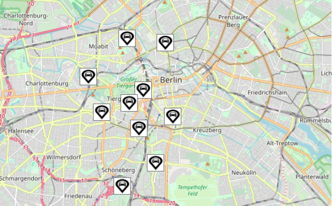

# Decentracar
{: .fs-9 }

Decentracar is a demonstration of how a decentralized ride sharing company could
work on a fast, accessible DLT like Tupelo.  The ride-sharing company acts to
screen and register both users and drivers but eligible riders and drivers then
use p2p pubsub to efficiently arrange rides without an expensive centralized
process.  

An explanation of Decentracar and its key components **[can be found here](https://www.tupelo.org/posts/decentracar ).**

A running demo of the application **[can be found here](https://quorumcontrol.github.io/decentracar/).**

An article on the related topic of the difference between disintermediation
and decentralization **[can be found here](https://www.tupelo.org/posts/dlt-isnt-disintermediation).**

[Decentracar on Github](https://github.com/quorumcontrol/decentracar){: .btn .btn-blue .fs-5 .mb-4 .mb-md-0 .mr-2 }  

&nbsp;  

***

Please reach out with any questions or comments you might have on the Decentracar project.  
We would appreciate hearing from you.


