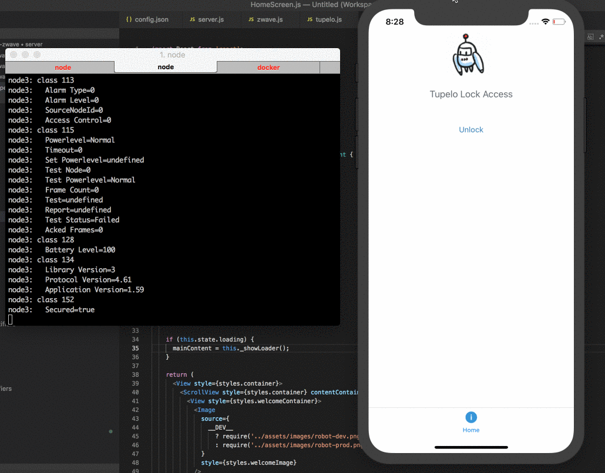

# IoT - Tupelo Based Lock Control via Zwave and Raspberry Pi
{: .fs-9 }

This was built by Nathan McDowell the winner of a Tupelo coding challenge.
This proof of concept IoT project uses ChainTrees, Zwave and Raspberry Pi to
remotely control a house lock.  

The react-native client can be granted temporary access with control and tracking
all signed by the Tupelo testnet.

There are wide applications for Tupelo for IoT because it is efficient,
fast and even includes the possibility of devices being able to check transaction
validity when they are offline.  A small example of offline functionality
can be found here but hop into our developer chat or ask for more information
if you have any questions.

[IoT lock control project on Github](https://github.com/natemcdowel/tupelo-zwave){: .btn .btn-blue .fs-5 .mb-4 .mb-md-0 .mr-2 }  
