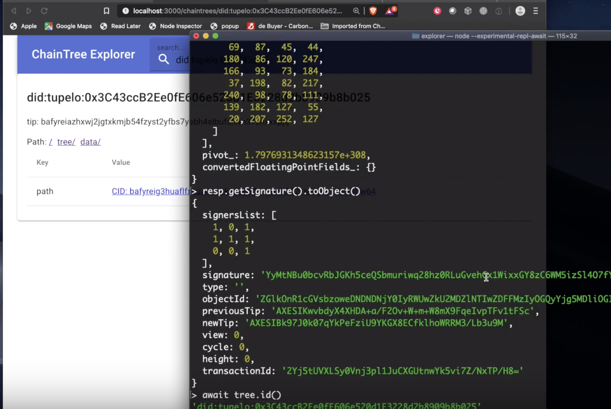

# Tupelo Explorer and Wallet
{: .fs-9 }

The WASM explorer is a react-based app using the Tupelo WASM SDK.  The explorer
enables users to browse ChainTrees the datastructure underlying Tupelo.
It can also be used as a wallet for Chaintrees (NFTs) you have created.

<iframe width="426" height="240" src="https://www.youtube.com/embed/4Oz03l9IQPc" frameborder="0" allow="accelerometer; autoplay; encrypted-media; gyroscope; picture-in-picture" allowfullscreen></iframe>

[Tupelo Explorer on Github](https://github.com/quorumcontrol/wasm-explorer){: .btn .btn-blue .fs-5 .mb-4 .mb-md-0 .mr-2 }  
