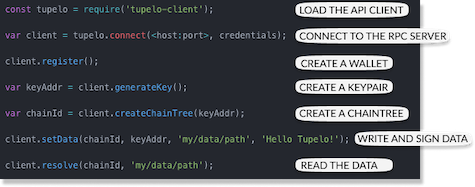
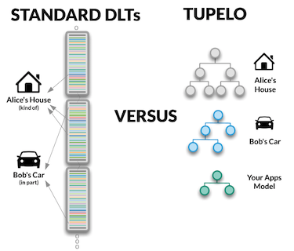
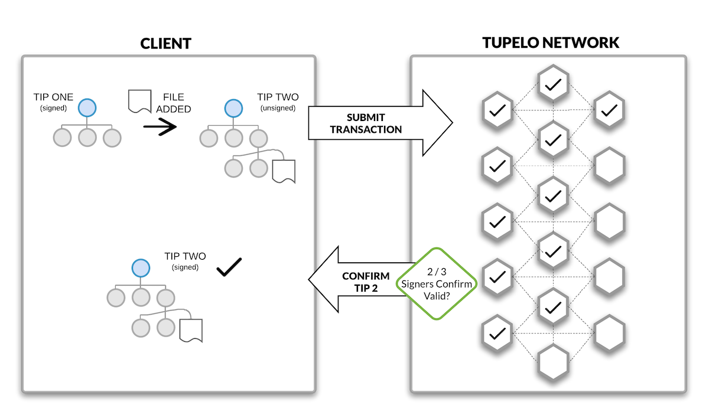

# Hello Decentralized World
{: .fs-8 }

We want to show you how easy it is to build on Tupelo.
{: .fs-5 .fw-300 }

Start building now by adding a [“Hello World” message](tutorials) and get it signed in seconds.
{: .fs-5 .fw-300 }
Need more information first?  
Read below to see how we’re different or get access to important documentation.
{: .fs-5 .fw-300 }
Want to jump right in and build?  Get started using your preferred web development framework and access
Tupelo using the new **[Tupelo WASM SDK](https://www.quorumcontrol.com/blog/2019/8/22/new-wasm-based-sdk-for-tupelo) right from the browser.**
{: .fs-5 .fw-300 }

# We Are Distributed Ledger Done Differently
{: .fs-8 }

**Tupelo is purpose-built for the things you’re building.**
ChainTrees, our completely unique data structure, open the door for practical,
real-world application development.
{: .fs-5 .fw-300 }

With ChainTrees, each object or actor is modeled independently allowing for
infinite sharding. This makes the underlying system much more efficient,
flexible, and transferrable than the existing cumbersome, single chain systems.
{: .fs-5 .fw-300 }
Our comprehensive documentation and accessible engineering team will cover
everything you need to know to build on the platform.
{: .fs-5 .fw-300 }
[Tupelo Overview](docs/litepaper){: .btn .btn-green .fs-5 .mb-4 .mb-md-0 .mr-2 }
[Whitepaper v0.10](docs/whitepaper){: .btn .btn-green .fs-5 .mb-4 .mb-md-0 .mr-2 }
[Talk to the Team](https://t.me/joinchat/IhpojEWjbW9Y7_H81Y7rAA){: .btn .btn-green .fs-5 .mb-4 .mb-md-0 .mr-2 }

***

# A Better Developer Experience
{: .fs-8 }

Traditional DLT platforms are often complicated to use because they aren’t built
for what you need. You’re spending too much time trying to compromise with
inherently inflexible code rather than building your application.
{: .fs-5 .fw-300 }
**Tupelo is easy.**
{: .fs-5 .fw-300 }
Through our simple API, growing list of familiar language libraries, and our
fast, cheap, public signing network, you can have your project up-and-running
in minutes.
{: .fs-5 .fw-300 }
Tupelo is built for building. Come see for yourself.
{: .fs-5 .fw-300 }

[Get Started](tutorials){: .btn .btn-green .fs-5 .mb-4 .mb-md-0 .mr-2 }

***
