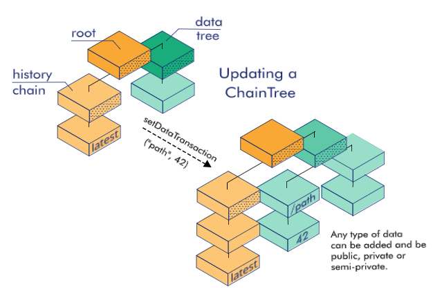

# Hello Decentralized World
{: .fs-8 }

Tupelo is easy.

The straightforward API and growing list of familiar language libraries make integrating
the power of a distributed ledger into your application fast and simple.
{: .fs-3 .fw-300 }

You can read all about Tupelo below, or if you prefer to learn by doing, **jump in and try our
new [Tupelo WASM SDK](https://www.tupelo.org/blog/2019/8/22/new-wasm-based-sdk-for-tupelo)**.
The WASM SDK enables you to easily leverage the power of trust that Tupelo
makes possible right from a browser.
{: .fs-3 .fw-300 }

Another option is to run through our [“Hello World” tutorials](tutorials) and have your
first transaction signed in minutes. That is a total of minutes to set up and submit the
request, the Tupelo TestNet will sign your transaction in less than a second.
{: .fs-3 .fw-300 }
***
# We Are Distributed Ledger Done Differently
{: .fs-8 }

**Tupelo is purpose-built for the things you’re building.**
ChainTrees, our completely unique data structure, open the door for practical,
real-world application development.
{: .fs-3 .fw-300 }

With ChainTrees, each object or actor is modeled independently allowing for
infinite sharding. This makes the underlying system much more efficient,
flexible, and transferrable than existing cumbersome, single chain systems.
{: .fs-3 .fw-300 }

A ChainTree is made up of a 'chain' for the history of the object and a 'tree' to flexibly
store relevant data.  The data can be of any type and be made public, private or semi-private
depending on your applications needs.
{: .fs-3 .fw-300 }
Read on to learn how this unique datastructure enables a much faster and more efficient
signing network while maintaining the integrity of the underlying data.
{: .fs-3 .fw-300 }
[Tupelo Overview](docs/litepaper){: .btn .btn-blue .fs-4 .mb-4 .mb-md-0 .mr-2 }
[Whitepaper v0.10](docs/whitepaper){: .btn .btn-blue .fs-4 .mb-4 .mb-md-0 .mr-2 }
[Talk to the Team](https://t.me/joinchat/IhpojEWjbW9Y7_H81Y7rAA){: .btn .btn-blue .fs-4 .mb-4 .mb-md-0 .mr-2 }
